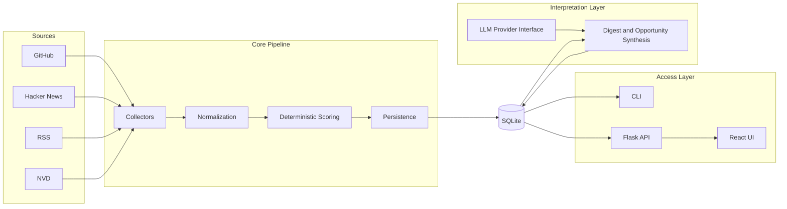
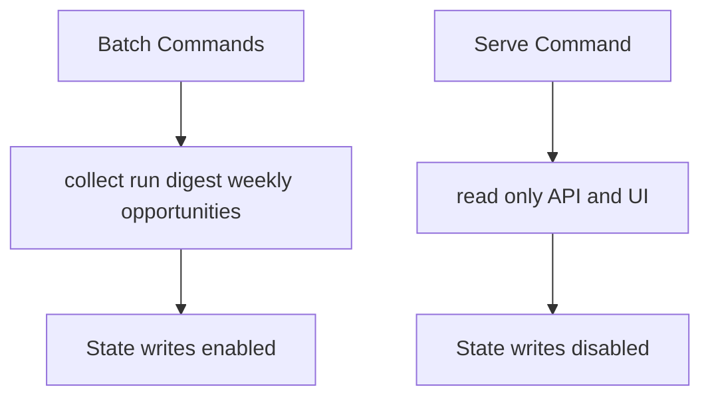
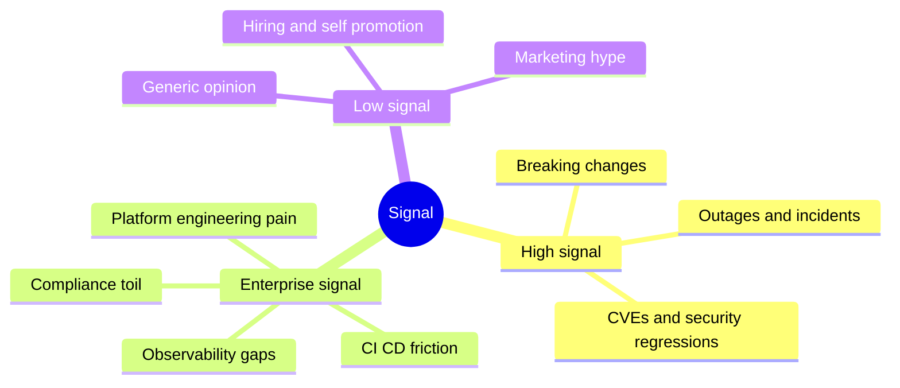
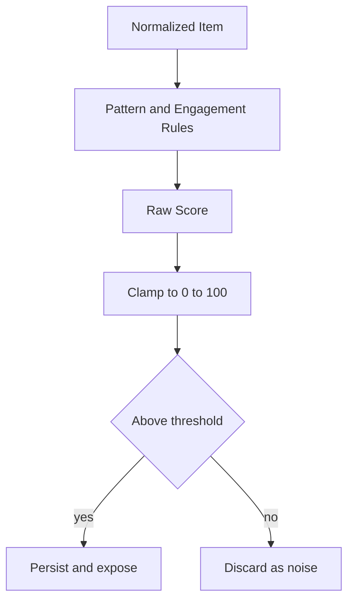

# HLD (High-Level Design)

## 1. Architecture Overview

### System Purpose

The system discovers enterprise developer-tool opportunities by collecting ecosystem pain signals, scoring them deterministically, and synthesizing findings into analyst-ready outputs.

### Scope

Included:
- Multi-source signal ingestion
- Deterministic scoring and filtering
- Historical persistence and run tracking
- Digest/opportunity synthesis and read-only serving

Excluded:
- Transactional product workflows
- Autonomous remediation/execution
- Real-time distributed event processing

### High-Level Data Flow

```text
Sources -> Ingest -> Normalize -> Score -> Persist -> Serve
```

### Container View



### Sync vs Async Boundaries

- Sync: collection, scoring, persistence, synthesis requests
- Async: none in core architecture

### Stateless vs Stateful

- Stateless: scoring logic, prompt templates, rendering adapters
- Stateful: SQLite, collector state, digest history, opportunity runs

### Deployment Boundaries

- Batch execution boundary (`main.py` commands)
- Serving boundary (Flask API + static frontend)
- Storage boundary (single local DB)

### Workflow Boundary View



## 2. Domain Model and Core Concepts

### Signal Taxonomy

- High-signal: technical instability and substantive engineering changes (breakage, outages, security incidents)
- Enterprise-signal: repeatable, budget-backed pain (compliance friction, DevOps toil, platform engineering gaps)
- Low-signal: hype, self-promotion, generic opinion with low operational consequence

### Taxonomy Diagram



### Definitions and Invariants

- `Item`: normalized collected artifact with source identity, content, metadata, and score
- `Digest`: human-readable summary of a time window
- `Opportunity`: structured inferred opportunity with confidence and supporting evidence
- `EvidenceRef`: linkable supporting artifact for an opportunity claim

Invariants:
- Item identity must be stable across reruns (source + source_id hash)
- Scoring output range is bounded and deterministic
- Structured opportunities must retain traceability to evidence records

### Scoring Philosophy

What is measured:
- Concrete pain language
- Severity and recurrence indicators
- Engagement proxies (comments, reactions, upvotes, CVSS)

What is intentionally ignored:
- Marketing narratives without technical consequence
- Surface-level popularity absent operational pain
- LLM-generated reinterpretation of upstream raw data at filtering stage

Stability guarantees:
- Same input item text and metadata produce the same score under same scoring rules
- Deterministic filtering thresholding yields repeatable inclusion/exclusion behavior
- Any scoring drift is explicit and version-controlled via rules changes

### Scoring Decision Diagram


