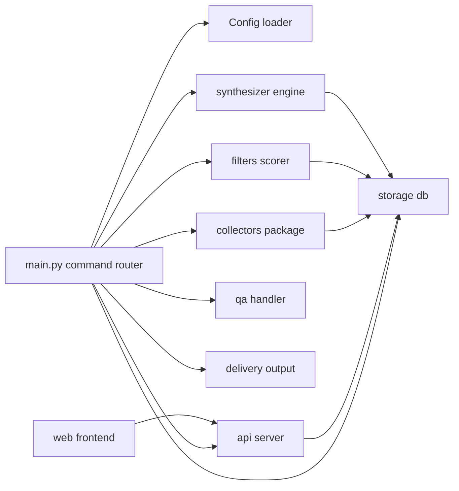
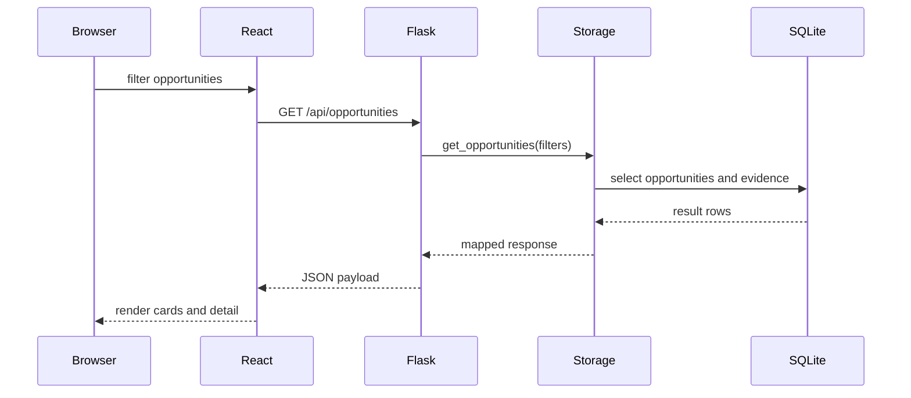
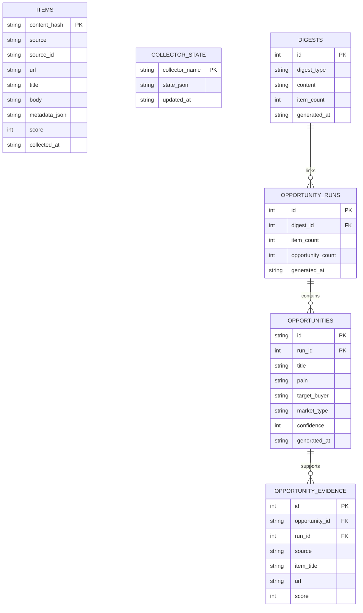
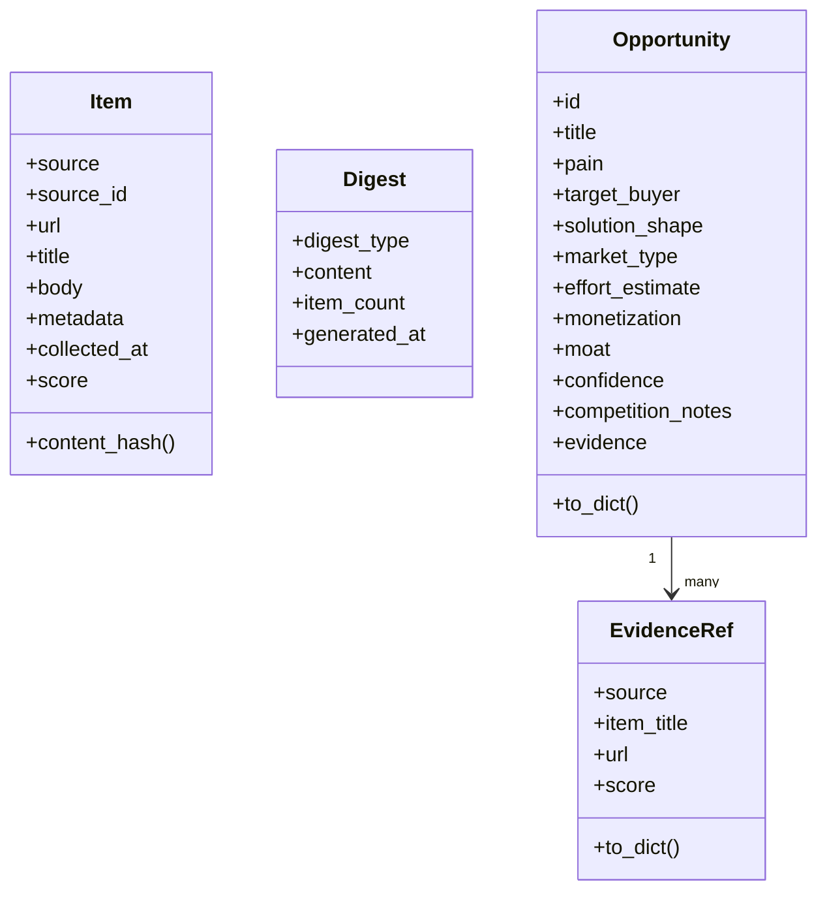
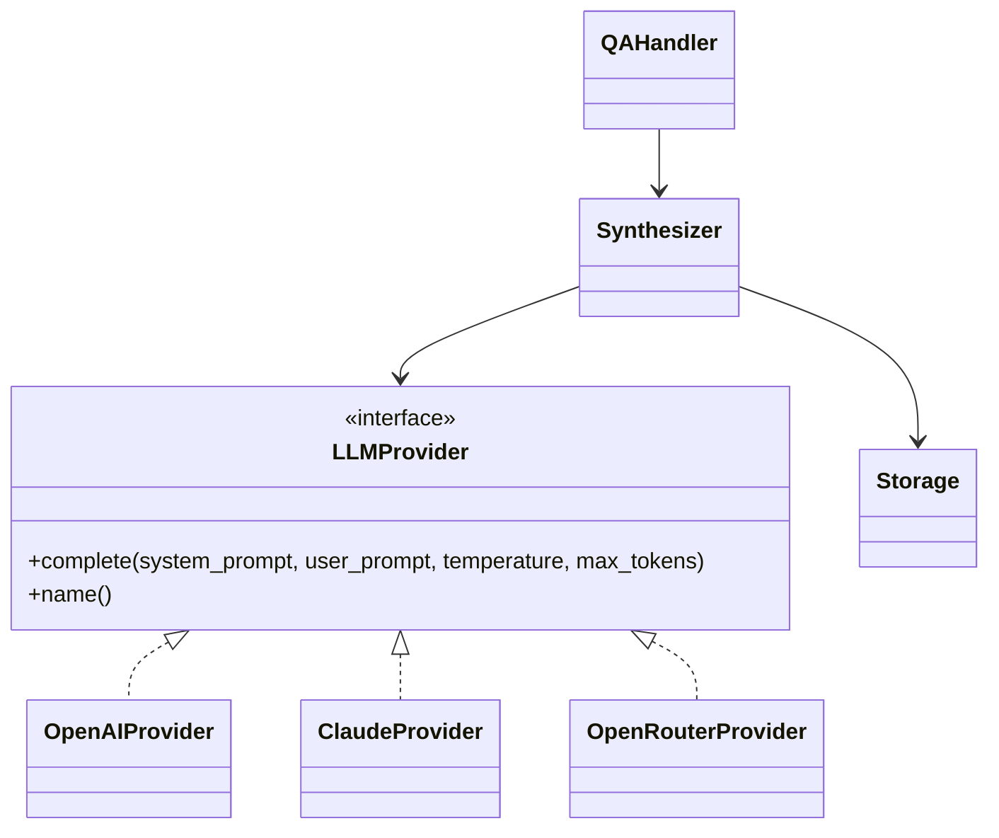

# LLD (Low-Level Design)

## 3. System Components

### Component Interaction Diagram

### Ingestion Layer

Responsibility:
- Pull raw artifacts from configured external sources

Inputs/Outputs:
- Input: source configuration, collector state checkpoints
- Output: normalized `Item` candidates before scoring

Failure Behavior:
- Source-specific failures are isolated; one failing collector does not terminate all collection

Idempotency and Retries:
- Idempotency via deterministic item hashing and DB existence checks
- Retries are minimal and source-specific; collector reruns are safe

Scaling Assumptions:
- Sequential collectors are sufficient for current source volume

### Normalization Pipeline

Responsibility:
- Convert heterogeneous payloads into canonical internal entities

Inputs/Outputs:
- Input: source API payloads
- Output: `Item` objects with unified fields and source metadata

Failure Behavior:
- Parsing failures drop problematic entries, not entire runs

Idempotency and Retries:
- Re-normalization is safe; identity remains source-bound

Scaling Assumptions:
- Text truncation and metadata capping prevent runaway payload sizes

### Scoring Engine

Responsibility:
- Apply deterministic pattern and engagement heuristics to rank signal quality

Inputs/Outputs:
- Input: normalized `Item`
- Output: scored `Item` with 0-100 bounded score

Failure Behavior:
- Missing optional metadata degrades score quality, not runtime stability

Idempotency and Retries:
- Pure deterministic mapping; rerun-safe

Scaling Assumptions:
- Regex-based rules remain computationally cheap for current batch sizes

### Persistence Layer

Responsibility:
- Store raw items, collector checkpoints, digest history, structured opportunities, and evidence links

Inputs/Outputs:
- Input: scored items and derived synthesis artifacts
- Output: queryable historical state

Failure Behavior:
- Insert conflicts are ignored for duplicates by design
- Partial writes are bounded by transaction scope

Idempotency and Retries:
- Duplicate inserts are safe and non-destructive
- Opportunity runs append historical snapshots

Scaling Assumptions:
- Single-file SQLite is adequate for single-node usage and modest concurrency

### API / Query Layer

Responsibility:
- Expose read-only access to persisted data for UI and integrations

Inputs/Outputs:
- Input: validated query parameters
- Output: JSON views over items, digests, opportunities, and trends

Failure Behavior:
- Invalid parameters should fail fast with client-visible errors

Idempotency and Retries:
- Read operations are naturally idempotent

Scaling Assumptions:
- Query latency acceptable with indexed SQLite and bounded page sizes

### API Read Path Sequence

## 4. Data Architecture

### Core Entities and Relationships

- `items`: canonical collected records
- `collector_state`: per-collector incremental cursors/state blobs
- `digests`: generated textual outputs
- `opportunity_runs`: one record per structured opportunity generation run
- `opportunities`: structured opportunities keyed by `(id, run_id)`
- `opportunity_evidence`: one-to-many evidence links per `(opportunity_id, run_id)`

Relationship intent:
- A run can produce multiple opportunities
- An opportunity can contain multiple evidence references
- Evidence preserves source-level traceability for auditability

### Database ER Diagram

### Tenant Isolation Model

Current model is single-tenant by deployment.

Implications:
- All data in one DB namespace
- No row-level tenant segmentation
- Multi-tenant evolution requires explicit tenant key propagation across all tables and indexes

### Schema Invariants

- Item primary identity is stable hash (`source + source_id`)
- Opportunity identity is stable slug within a run context
- Opportunity evidence rows must reference an existing `(opportunity_id, run_id)` pair
- Collector state keys must remain backward-compatible across collector evolution

### Migration Strategy Assumptions

- Schema evolution uses additive, in-place SQL migrations executed at startup
- No external migration framework is required in current architecture
- Backward compatibility relies on non-destructive table/index additions

## 5. Class and Interface Model

### Domain Class Diagram

### Service UML Diagram

## 8. Repository Map (By Intent)

- `main.py`: orchestration boundary and command routing
- `config/`: runtime configuration contract and env loading
- `collectors/`: source adapters and ingestion concerns
- `filters/`: deterministic ranking and noise suppression
- `storage/`: schema ownership and persistence contract
- `synthesizer/`: LLM boundary and opportunity/digest generation
- `qa/`: focused question-answering wrapper over synthesis layer
- `delivery/`: output channels (CLI/email)
- `api/`: read-only query surface over persisted artifacts
- `web/`: operator-facing exploration UI
- `data/`: local persisted state files

### Where Future Changes Should Go

- New source integrations: `collectors/`
- New deterministic ranking rules: `filters/scorer.py`
- New persisted entity classes and table contracts: `models.py` + `storage/db.py`
- New read interfaces: `api/server.py`
- New UI views over existing API contracts: `web/src/components/`
- New cross-cutting architecture rationale: update `docs/architecture.md`
